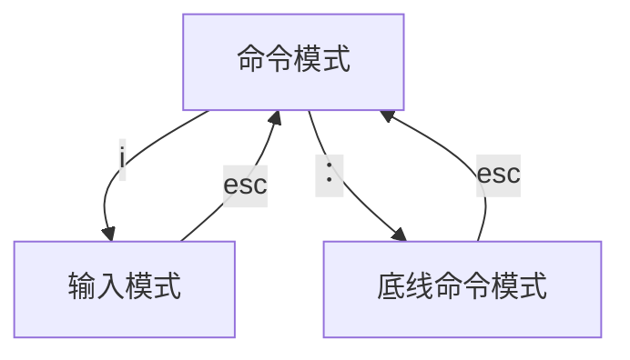

[TOC]  
- 操作系统是软件的一类，充当用户和计算机硬件之间的桥梁。

- Linux系统由两部分组成：
    1. Linux系统内核：调度CPU、调度内存、调度网络通讯、调度IO等。
    2. 系统级应用程序：文件管理器、任务管理器、图片查看、音乐播放等。
- 快照可以用来备份linux系统
- Linux只有一个顶级目录：/
---
# Linux快捷键
- `ctrl + C`：强制停止。
- `ctrl + D`：强制退出或登出。
- `ctrl + R`：搜索历史命令，搜索匹配到最近的命令。
- `! + 命令前缀`：自动匹配上一个命令。
- `ctrl + A`：移动光标到命令开头。
- `ctrl + E`：移动光标到命令末尾。
- `ctrl + <-`：光标向左移动一个单词。
- `ctrl + ->`：光标向右移动一个单词
- `ctrl + l`：清屏，功能同`clear`命令。
---
# Linux命令
## 通用命令
- `ifconfig`
查看IP地址。
- `su -root`
进入管理员账户。
- `exit`
退出管理员账户。
## ls 查看工作目录的内容
- 语法：`ls [-a -l -h] [路径]`
- `ls`
平铺当前工作目录下的内容。
Linux默认工作目录为`/home/hongcheng`。
- `ls -a`
平铺当前工作目录下的内容，包含以`.`开头的隐藏文件。
- `ls -l`
以列表的形式显示当前工作目录下的内容。
- `ls -a -l`、`ls -al`或者`ls -la`
以列表的形式显示当前工作目录下的内容，包含以`.`开头的隐藏文件。
- `ls /`
平铺根目录下的内容。
- `ls -al /`
以列表的形式显示根目录下的内容，包含以`.`开头的隐藏文件。
- `ls -lh /`
以列表的形式显示根目录下的内容，并且显示文件大小。
## cd 切换工作目录
- 语法：`cd [路径]`
- `cd /bin`
将工作目录切换到`/bin`下。
- `cd .`
切换到当前工作目录。
- `cd ..`
将工作目录返回上一级。
- `cd ../..`
将工作目录返回上两级。
- `cd`或者`cd ~`
将工作目录切回`/home/hongcheng`
## pwd 打印工作目录
- 语法：`pwd`
打印当前工作目录。
## mkdir 创建文件夹
- 语法：`mkdir [-p] 路径`
- `mkdir ../test`
在上一级目录下创建test文件夹
- `mkdir dir1 dir2`
在当前工作目录下创建两个文件夹`div1`和`div2`.
- `mkdir -p test/test1`
在test目录不存在的情况下创建多层目录，`-p`选项表示自动创建不存在的父目录。
- `mkdir`命令不能在`/home/hongcheng`目录外创建文件夹，因为权限不足。
## touch 创建文件
- 语法：`touch 路径`
- `touch test.txt`
在当前工作目录下创建`test.txt`文件。
- `touch test1.txt test2.txt`
在当前工作目录下创建两个文件`test1.txt`和`test2.txt`。
## cat 打印文件内容
- 语法：`cat 路径`
- `cat test.txt`
打印`test.txt`的内容。
## more 打印文件内容
- 语法：`more 路径`
- `more test.txt`
打印`test.txt`的内容，与cat不同，more支持翻页查看，按上下键翻页，按`Q`退出。
## cp 复制文件或文件夹
- 语法：`cp [-r] 路径1 路径2`
- `cp test1.txt test2.txt`
将文件`test1.txt`的内容复制到`test2.txt`中。
- `cp -r dir1 dir2` 
将目录`dir1`复制到`dir2`下，目录结构为`dir2/dir1`。
## mv 移动文件或文件夹
- 语法：`mv 路径1 路径2`
- `mv test.txt dir`
将`test.txt`移动到`dir`目录下。
- `mv test.txt test1.txt`
当`mv`命令的路径2不为文件夹时，会将`test.txt`改名为路径2。
## rm 删除文件或文件夹
- 语法：`rm [-r -f] 路径`
- `rm test1.txt test2.txt`
删除文件`test1.txt`和`test2.txt`。
- `rm -r dir`
删除文件夹`dir`。
- `rm -f root.txt`
强制删除文件`root.txt`，一般用于管理员账户。
- `rm -r test*`
删除以`test`开头的文件和文件夹，原理同正则表达式。（通配符）
- `rm -rf /`或者`rm -rf /*`
在管理员用户下执行，删除整个文件系统，相当于Windows系统C盘格式化。
## which 
- 语法：`which 要查找的命令`
查找命令的程序文件存放在哪里。
## find
1. 按文件名查找
- 语法：`find 起始路径 -name "被查找的文件名"`
- `find dir -name "test*"`
在`dir`文件夹下查找以`test`开头的文件
想要在整个根目录下进行查找，需要切换到管理员用户。
2. 按文件大小查找
- 语法：`find 起始路径 -size +|-n[kMG]`
- `find / -size -10k`
在根目录下查找小于10k的文件。
- `find / -size +1G`
在根目录下查找大于1G的文件。
## echo 打印输出
- 语法：`echo 输出的内容`
- `echo hello`或者`echo "hello"`
打印输出`hello`
- `` echo `pwd` ``
输出并执行`pwd`命令。（飘号）
- `echo "hello" > test.txt`
将`hello`覆盖写入到`test.txt`内。（重定向府）
- `echo "hello" >> test.txt`
将`hello`追加写入到`test.txt`内。
- `ls >> test.txt`
将`ls`的结果追加写入到`test.txt`内。
## tail 查看文件末尾的内容
- 语法：`tail [-f -num] 路径`
- `tail test.txt`
查看`test.txt`末尾10行的内容。
- `tail -5 test.txt`
查看`test.txt`末尾5行的内容。
- `tail -f test.txt`
持续查看`test.txt`末尾10行的内容，动态更改，可以`ctrl`+`C`停止。
## grep 文件内容匹配
- 语法：`grep [-n] 关键字 路径`
- `grep "hello" test.txt`
在`test.txt`里匹配包含`hello`的行。
- `grep -n "hello" test.txt`
在`test.txt`里匹配包含`hello`的行，并且显示行号。
## history
- 语法：`hostory [| grep 命令前缀]`
- `history`
显示历史执行过的命令。
- `history | grep c`
显示历史命令中以`c`开头的命令。
## wc 显示文件的文本量
- 语法：`wc [-c -m -l -w] 路径`
- `wc test.txt`
显示`test.txt`的行数、单词数、字节数、文件名。
- `wc -c test.txt`
显示`test.txt`的字节数、文件名。
- `wc -m test.txt`
显示`test.txt`的字符数、文件名。
- `wc -l test.txt`
显示`test.txt`的行数、文件名。
- `wc -w test.txt`
显示`test.txt`的单词数、文件名。
- `cat test.txt | wc -l`
显示`test.txt`的行数。（管道符|将左边的结果当做右边的输入，管道符可以嵌套使用）
## vi 编辑文件
1. **vim包含vi的所有功能**
- 语法：`vim 路径`
- `vim test.txt`
如果`test.txt`存在，编辑文件，否侧创建一个新文件。
2. **执行vim后首先进入命令模式**

3. **命令模式快捷键**

|模式|命令|描述|
|:----|:----|:----|
|命令模式|i|在当前光标位置进入输入模式|
|命令模式|:|进入底线命令模式|
|命令模式|0|移动光标到当前行开头|
|命令模式|&|移动光标到当前行末尾|
|命令模式|pgup|向上翻页|
|命令模式|pgdn|向下翻页|
|命令模式|/|进入搜索模式|
|命令模式|n|向下搜索|
|命令模式|N|向上搜索|
|命令模式|dd|删除光标所在行|
|命令模式|3dd|删除光标位置的后三行|
|命令模式|yy|复制光标所在行|
|命令模式|3yy|复制光标位置的后三行|
|命令模式|p|粘贴|
|命令模式|u|撤销|
|命令模式|ctrl + r|反撤销|
|命令模式|gg|跳转到首行|
|命令模式|G|跳转到尾行|
|命令模式|dG|从当前位置删除到尾行|
|命令模式|dgg|从当前位置删除到首行|
|命令模式|d$|从当前位置删除到行尾|
|命令模式|d0|从当前位置删除到行首|
4. **底线命令模式快捷键**

|模式|命令|描述|
|:----|:----|:----|
|底线命令模式|wq|保存并退出|
|底线命令模式|q|仅退出|
|底线命令模式|w|仅保存|
|底线命令模式|q!|强制退出|
|底线命令模式|set nu|显示行号|
|底线命令模式|set paste|设置粘贴模式，防止错乱|
## su 切换用户
- 语法：`su [-] [用户名]`
- `su - hongcheng`
切换到用户`hongcheng`。
- `su - `
切换到管理员账户。
`-`表示切换后加载环境变量。
## sudo 代替root用户执行命令
- 语法：`sudo 其他命令`
- `sudo rm -rf /`
`sudo`可以让普通命令带上`root`权限。
需要在管理员账户下执行visudo命令，授权普通用户使用`sudo`命令。

## groupadd 创建用户组
- 语法：`groupadd 用户组名`
创建用户组。
## groupdel 删除用户组
- 语法：`groupdel 用户组名`
删除用户组。
## useradd 创建用户
- 语法：`useradd [-g -d] 用户名`
- `useradd user1 -g group1 -d /home/users`
创建用户`user1`添加到`group1`用户组里，并指定HOME路径为`/home/users`。
-g 表示指定用户组，-d表示指定HOME路径。
## userdel 删除用户
- 语法：`userdel [-r] 用户名`
-r表示删除用户时删除HOME目录。
- `userdel -r user1`
删除用户`user1`，同时删除HOME目录。
## id 查看用户信息
- 语法：`id [用户名]`
查看用户的信息，不指定用户表示查看当前用户的信息。
## usermod 将用户添加到用户组
- 语法：`usermod -aG 用户组 用户名`
将指定用户加入到指定用户组里。
## getent 显示系统中的用户
- 语法：`getent passwd`
查看当前系统中有哪些用户。
## chmod 修改文件权限
- 语法：`chmod [-R] 权限 文件或文件夹`
-R表示对文件夹内部的内容同步修改权限
- `chmod u=rwx,g=rx,o=x hello.txt`
将hello.txt的权限修改为：所属用户权限为rwx，所属用户组权限为rx，其他用户权限为x。
- `chmod -R u=rwx,g=rx,o=x div`
将div和下面的所有内容的权限修改为：所属用户权限为rwx，所属用户组权限为rx，其他用户权限为x。
## chown 修改文件所属用户或用户组
- 语法：`chown [-R] [用户][:][用户组] 文件或文件夹`
`-R`表示对文件夹内部的内容同步修改所属用户或用户组
`：`用于区分用户和用户组。
`chown`命令只能在root用户下执行。
- `chown root hello.txt`
将`hello.txt`的所属用户修改为`root`。
- `chown :group1 hello.txt`
将`hello.txt`的所属用户组修改为`group1`。
- `chown hongcheng:group1 hello.txt`
将`hello.txt`的所属用户修改为`hongcheng`，所属用户组修改为`group1`。
- `chown -R root div`
将文件夹`div`和所有的内容的所属用户修改为`root`。
## yum 安装软件
- 语法：`yum [-y] [install|remove|search]`
选项`-y`表示自动确认，无序手动确认安装或卸载。
执行`yum`命令需要`root`权限，并且需要联网。
- `yum search wget`
查看应用商店是否有`wget`程序。
- `yum -y install wget`
下载`wget`程序。
- `yum`命令在CentOS执行，`apt`命令在Ubuntu系统执行，语法与`yum`相同。
## systemctl 软件管理
- 语法：`sytsemctl start|stop|status|enable|disable 软件名`
能被`systemctl`管理的软件，一般也称为：服务。
<table>
  <tr>
    <td>start</td>
    <td>启动</td>
  </tr>
  <tr>
    <td>stop</td>
    <td>关闭</td>
  </tr>
  <tr>
    <td>status</td>
    <td>查看状态</td>
  </tr>
  <tr>
    <td>enable</td>
    <td>开启开机自启</td>
  </tr>
  <tr>
    <td>disable</td>
    <td>关闭开机自启</td>
  </tr>
</table>

## ln 创建软链接
- 语法：`ln -s 被链接的文件或文件夹 要链接去的目的地`
软链接类似于windows系统上的快捷方式。
- `ln -s fileA fileB`
建立从`fileA`到`fileB`的软链接，执行`fileB`能跳转到`fileA`。
## date
- 语法：`date [-d] [+格式化字符串]`
- ` date `
查看当前的日期和时间：`2022年 10月 08 日 星期六 00:45:45 UTC`。
- ` date +%Y-%m-%d `
`2022-10-08`
- ` date "+%Y-%m-%d %H:%M:%S" `
`2022-10-08 00:48:12`
- ` date -d "+1 day" `
-d表示对时间的计算，输出`2022年 10月 08 日 星期六 00:45:45 UTC `。
- 切换时区：需要切换到`root`用户。
```
rm -f /etc/localtime
ln -s /usr/share/zoneinfo/Asia/Shanghai /etc/localtime
```
- 自动校准时间程序：
```
ntp:yum -y install ntp//安装
systemctl start ntpd //开启自启动
systemctl enable ntpd
```


# Linux权限
- Linux的权限一共分为三种。

|权限符号|权限|对于文件的权限|对于文件夹的权限|
|:-:|:-:|:-|:-|
|r|read|文件可读|文件夹可以显示内容|
|w|write|文件可更改|文件夹可更改|
|x|execute|文件可执行|可以将文件夹作为工作目录|

- 文件的权限共分为10个槽位，`ls l`命令可以查看当前工作目录下每个文件的权限信息。

<table>
  <tr>
    <td colspan="1"style="text-align: center;font-weight: bold;">文件类型</td>
    <td colspan="3"style="text-align: center;font-weight: bold;">所属用户权限</td>
    <td colspan="3"style="text-align: center;font-weight: bold;">所属用户组权限</td>
    <td colspan="3"style="text-align: center;font-weight: bold;">其他用户权限</td>
  </tr>
  <tr>
    <td>-或d或l</td>
    <td>r或-</td>
    <td>w或-</td>
    <td>x或-</td>
    <td>r或-</td>
    <td>w或-</td>
    <td>x或-</td>
    <td>r或-</td>
    <td>w或-</td>
    <td>x或-</td>
  </tr>
</table>

-权限可以用3位数字表示，每一位分别表示用户权限，用户组权限，其他用户权限。r记为4,w记为2,x记为1.
|数字|权限|
|:-:|:-:|
|0|---|
|1|--x|
|2|-w-|
|3|-wx|
|4|r--|
|5|r-x|
|6|rw-|
|7|rwx|

